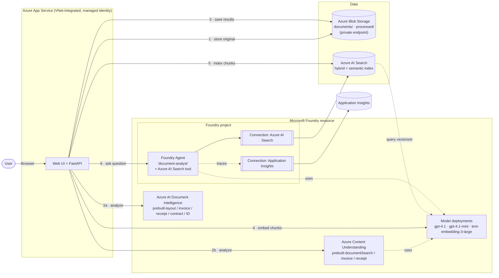
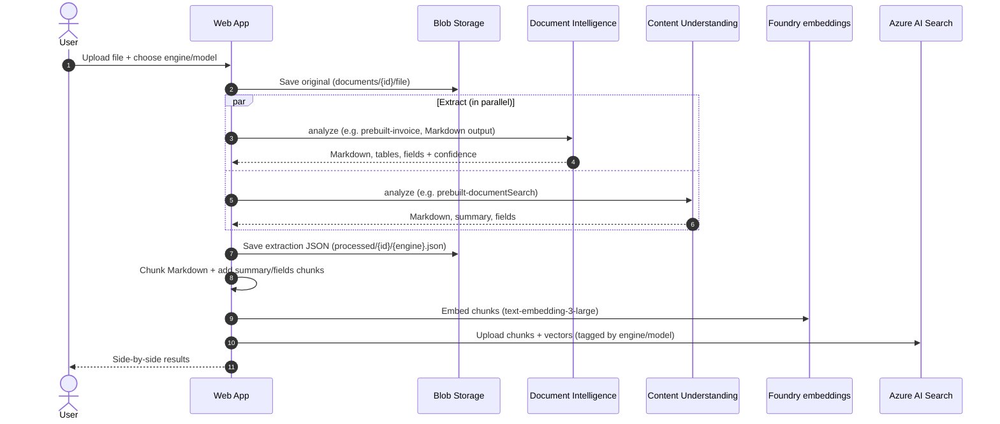
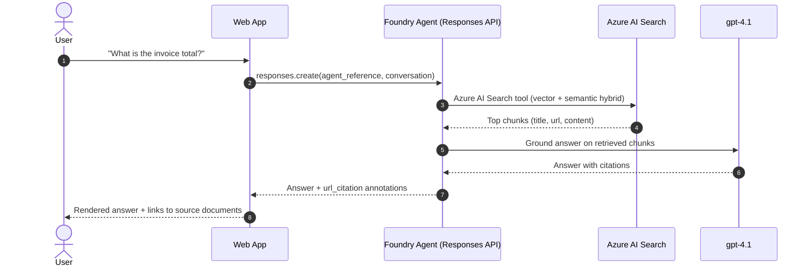
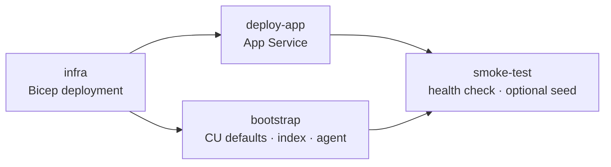

# Intelligent Document Processing with Microsoft Foundry

This reference solution shows how to **ingest, extract, index and query documents** with Azure AI services on **Microsoft Foundry**:

- **Azure AI Document Intelligence** extracts layout, tables and key fields (invoices, receipts, IDs, contracts) and returns a confidence score for each field.
- **Azure Content Understanding** produces RAG-ready Markdown, generative summaries and schema-based field extraction.
- **Azure AI Search** stores document chunks with vector, keyword and semantic ranking.
- A **Foundry Agent** answers natural-language questions over the processed documents and cites its sources.

Everything is deployed as code with **Bicep**. The agent is built with the **Foundry SDK** (`azure-ai-projects`), and **GitHub Actions** provides CI/CD. Every service-to-service call uses **Microsoft Entra ID (managed identity)**; there are no API keys.

---

## Contents

1. [Architecture](#1-architecture)
2. [How it works](#2-how-it-works)
3. [Azure services used](#3-azure-services-used)
4. [Repository structure](#4-repository-structure)
5. [Deploy](#5-deploy)
6. [Use the app](#6-use-the-app)
7. [Sample documents](#7-sample-documents)
8. [Sample queries](#8-sample-queries)
9. [Document Intelligence vs Content Understanding](#9-document-intelligence-vs-content-understanding)
10. [API reference](#10-api-reference)
11. [Security](#11-security)
12. [Customize and extend](#12-customize-and-extend)
13. [Troubleshooting](#13-troubleshooting)
14. [Clean up](#14-clean-up)

---

## 1. Architecture



### Ingestion flow



### Query flow



---

## 2. How it works

| Step | What happens | Code |
|---|---|---|
| **Upload** | The file is validated (type and size) and stored in Blob Storage. | [src/app/pipeline.py](src/app/pipeline.py) |
| **Extract** | **Document Intelligence** and/or **Content Understanding** analyze the file. With *Compare both*, the two engines run in parallel. | [src/app/extractors.py](src/app/extractors.py) |
| **Persist** | The normalized results (Markdown, summary, fields, page and table counts, latency) are saved as JSON. | [src/app/storage.py](src/app/storage.py) |
| **Index** | The Markdown is split into chunks, and the summary and structured fields are added as their own chunks. Chunks are embedded with `text-embedding-3-large` and uploaded to Azure AI Search, which has a built-in Foundry vectorizer and a semantic configuration. | [src/app/indexer.py](src/app/indexer.py) |
| **Query** | A **Foundry prompt agent** uses the built-in **Azure AI Search tool** through a project connection. Conversations keep multi-turn context, and citations link back to the original file. | [src/app/agent.py](src/app/agent.py) |
| **Setup** | This one-time step configures the Content Understanding model defaults, creates the search index and publishes the agent. | [src/app/bootstrap.py](src/app/bootstrap.py) |

---

## 3. Azure services used

| Service | Purpose | SKU (default) |
|---|---|---|
| Microsoft Foundry (AI Services) + project | Hosts Document Intelligence, Content Understanding, the models and the Agent Service | S0 |
| Model: `gpt-4.1` | Agent reasoning and Content Understanding field extraction | GlobalStandard |
| Model: `gpt-4.1-mini` | Content Understanding `prebuilt-*Search` analyzers | GlobalStandard |
| Model: `text-embedding-3-large` | Chunk and query embeddings | GlobalStandard |
| Azure AI Search | Hybrid (vector + keyword) and semantic retrieval | Basic |
| Azure Blob Storage | Original documents and extraction results | Standard LRS, private endpoint |
| Azure App Service (Linux, Python 3.11) | Web UI + API | B2 |
| Virtual Network + Private DNS | Private access from the app to storage | — |
| Application Insights + Log Analytics | App telemetry and Foundry agent tracing | Pay-as-you-go |

All resources and role assignments are defined in [infra/main.bicep](infra/main.bicep).

---

## 4. Repository structure

```
├── infra/
│   ├── main.bicep              # All Azure resources, connections and RBAC
│   └── main.bicepparam         # Parameters (env name, region, deployer identity)
├── src/
│   ├── requirements.txt
│   └── app/
│       ├── main.py             # FastAPI routes
│       ├── pipeline.py         # Ingestion orchestration
│       ├── extractors.py       # Document Intelligence + Content Understanding
│       ├── indexer.py          # Search index, chunking, embeddings
│       ├── agent.py            # Foundry agent definition + chat
│       ├── storage.py          # Blob storage helpers
│       ├── bootstrap.py        # One-time setup (CU defaults, index, agent)
│       ├── config.py           # Settings from environment
│       └── static/             # Single-page web UI
├── samples/                    # Sample documents to try
├── scripts/
│   ├── deploy-local.ps1        # One-command deployment from a workstation
│   └── setup-github-oidc.ps1   # One-time GitHub Actions ↔ Azure OIDC setup
└── .github/workflows/deploy.yml  # CI/CD: infra → app + bootstrap → smoke test → seed
```

---

## 5. Deploy

### Prerequisites

- An Azure subscription where you have **Owner** rights, or **Contributor** plus **Role Based Access Control Administrator**, on the target resource group
- [Azure CLI](https://learn.microsoft.com/cli/azure/install-azure-cli) 2.60 or later, signed in with `az login`
- Python 3.11
- PowerShell 7 (for the scripts)
- A region that supports **Content Understanding** and the three models. The default is `swedencentral`; see [Content Understanding region support](https://learn.microsoft.com/azure/ai-services/content-understanding/language-region-support).
- Available quota for `gpt-4.1`, `gpt-4.1-mini` and `text-embedding-3-large` (GlobalStandard, 50K TPM each by default)

### Option A: one command from your workstation

```powershell
./scripts/deploy-local.ps1 -ResourceGroup rg-docdemo -Location swedencentral -Seed
```

This script:
1. Deploys `infra/main.bicep` and grants your identity the required data-plane roles.
2. Writes a local `.env` from the deployment outputs.
3. Runs `python -m app.bootstrap`, which configures the Content Understanding model defaults, creates the search index and publishes the Foundry agent.
4. Deploys the web app.
5. With `-Seed`, sends three sample documents through the app (an invoice, a receipt and a contract).

The script prints the web app URL when it finishes.

### Option B: GitHub Actions (CI/CD)

1. Push this folder to a GitHub repository.
2. Run the one-time OIDC setup. It creates a federated identity, so the repo needs no stored secrets:
   ```powershell
   ./scripts/setup-github-oidc.ps1 -Repo <org>/<repo> -ResourceGroup rg-docdemo -Location swedencentral
   ```
3. Run the workflow, either from **Actions → deploy → Run workflow** or with:
   ```powershell
   gh workflow run deploy -f seed=true
   ```

The workflow ([.github/workflows/deploy.yml](.github/workflows/deploy.yml)) runs these jobs:



It runs automatically on every push to `main` that changes `infra/`, `src/` or the workflow file.

### Parameters

| Parameter | Default | Description |
|---|---|---|
| `environmentName` | `docdemo` | Prefix used in resource names |
| `location` | `swedencentral` | Azure region |
| `chatModelName` / `chatModelVersion` | `gpt-4.1` / `2025-04-14` | Agent and Content Understanding completion model |
| `miniModelName` | `gpt-4.1-mini` | Content Understanding search analyzers |
| `embeddingModelName` | `text-embedding-3-large` | Embeddings |
| `*Capacity` | `50` | Capacity (TPM, in thousands) for each model deployment |
| `appServiceSku` | `B2` | App Service plan |

---

## 6. Use the app

Open the web app URL. The page has three panels:

| Panel | What to do |
|---|---|
| **1 · Ingest & extract** | Drop a file, choose an **engine** (*Compare both*, *Document Intelligence* or *Content Understanding*) and a **model or analyzer**, then click **Process & index**. |
| **2 · Extraction results** | See each engine side by side: latency, page and table counts, extracted **fields with confidence scores**, the **generative summary** (Content Understanding) and the rendered or raw **Markdown**. Click a document in the **library** to reopen its results. |
| **3 · Ask the Foundry agent** | Ask questions in plain language. Answers are grounded in the indexed documents, and the 📄 links open the source file. Use **＋** to start a new conversation. |

The agent is also visible in the **Foundry portal** (https://ai.azure.com). Open your project and go to **Agents** → `document-analyst` to test it in the playground, view its tools, and review **Tracing**.

---

## 7. Sample documents

The [samples/](samples/) folder contains ready-to-use documents. Use these engine settings for the best results:

| File | Type | Document Intelligence model | Content Understanding analyzer |
|---|---|---|---|
| [invoice-contoso.pdf](samples/invoice-contoso.pdf) | Invoice with line items | `prebuilt-invoice` | `prebuilt-invoice` |
| [invoice-sample.pdf](samples/invoice-sample.pdf) | Invoice | `prebuilt-invoice` | `prebuilt-invoice` |
| [receipt-contoso.png](samples/receipt-contoso.png) | Retail receipt (photo) | `prebuilt-receipt` | `prebuilt-receipt` |
| [receipt-contoso-2.png](samples/receipt-contoso-2.png) | Retail receipt (photo) | `prebuilt-receipt` | `prebuilt-receipt` |
| [id-license.png](samples/id-license.png) | Driver's license (sample) | `prebuilt-idDocument` | `prebuilt-documentSearch` |
| [contract-property-management.pdf](samples/contract-property-management.pdf) | Multi-page agreement | `prebuilt-contract` | `prebuilt-documentSearch` |
| [contract-purchase.pdf](samples/contract-purchase.pdf) | Purchase contract | `prebuilt-contract` | `prebuilt-documentSearch` |
| [layout-report.pdf](samples/layout-report.pdf) | Report with tables and sections | `prebuilt-layout` | `prebuilt-documentSearch` |
| [mixed-financial-docs.pdf](samples/mixed-financial-docs.pdf) | Several financial documents in one PDF | `prebuilt-layout` | `prebuilt-documentSearch` |

> These sample files come from Microsoft's public [Azure-Samples](https://github.com/Azure-Samples) repositories (MIT license) and contain only fictitious data.

You can upload your own PDFs, images (JPG, PNG, TIFF, BMP, HEIF) and Office files (DOCX, XLSX, PPTX) up to 25 MB.

---

## 8. Sample queries

Ingest the samples first, then try these questions in the **Ask the Foundry agent** panel.

### Invoices
- *What is the invoice total, due date and vendor?*
- *List all line items on the Contoso invoice in a table with quantity, unit price and amount.*
- *Who is the customer on the invoice and what is the billing address?*
- *Is there any amount still due? How does it compare to the invoice total?*

### Receipts
- *What was purchased on the Contoso receipt, and what was the total including tax?*
- *Which merchant issued the receipt, and when?*
- *How much tax was charged, and what percentage of the subtotal is that?*

### Contracts
- *What are the key terms of the property management agreement: parties, term and management fee?*
- *What are the termination conditions in the property management agreement?*
- *Summarize the obligations of each party in the purchase contract.*
- *Are there any fees in addition to the management fee? List them.*

### Across documents
- *Summarize every document I've uploaded in one sentence each.*
- *Which documents mention Microsoft?*
- *List all monetary amounts across the documents, grouped by document.*

### Compare the two engines
- *Compare what Document Intelligence and Content Understanding extracted from the receipt.*
- *Which engine returned more fields for the invoice, and do the totals match?*

### Grounding check (the agent should decline)
- *What is the CEO's favorite color?* The agent should say this isn't in the documents.

**Example response** (from the deployed solution):

> **Q:** *What was purchased on the Contoso receipt and what was the total including tax?*
>
> | Description | Quantity | Total Price (USD) |
> |---|---|---|
> | Surface Pro 6 | 2 | $1,998.00 |
> | Surface Pen | 3 | $299.97 |
>
> Subtotal: $2,297.97 · Tax: $218.31 · **Total including tax: $2,516.28** 📄 receipt-contoso.png

---

## 9. Document Intelligence vs Content Understanding

Both services run on the same Foundry resource. Choose one based on the workload, or use both:

| | **Azure AI Document Intelligence** | **Azure Content Understanding** |
|---|---|---|
| Best for | High-volume, well-known document types; deterministic OCR/layout; custom-trained extraction models | RAG ingestion, generative summaries, flexible schema-driven extraction; multimodal (documents, images, audio, video) |
| Output | Markdown/text, tables, key-value pairs, typed fields + confidence | Markdown, **summary**, fields defined by an analyzer schema, confidence and grounding |
| Customization | Custom template/neural models trained on labeled samples | Custom analyzers defined by a field schema (natural-language field descriptions), optional labeled data |
| Models used | Purpose-built Document Intelligence models | Content extraction + generative models you deploy (`gpt-4.1`, `gpt-4.1-mini`, embeddings) |
| In this app | Engine = *Document Intelligence* | Engine = *Content Understanding* |

Choose **Compare both** in the app to see the latency, field coverage and output style of each engine on the same file.

### 9.1 Prebuilt Document Intelligence models in this app

| Model | What it does | Key output | Typical use cases | Try with |
|---|---|---|---|---|
| `prebuilt-read` | **OCR only.** Reads printed and handwritten text in many languages and detects the language. No structure or fields. | Text lines and words with positions, languages | Digitizing scans, full-text search over archives, handwritten notes | [layout-report.pdf](samples/layout-report.pdf) |
| `prebuilt-layout` | **OCR + document structure.** Detects paragraphs and their roles (title, section heading, header, footer), **tables** (including merged cells), selection marks (checkboxes) and figures. Returns **Markdown**. | Markdown, tables, paragraphs with roles, checkboxes | The foundation for RAG chunking, table extraction from reports, forms with checkboxes | [layout-report.pdf](samples/layout-report.pdf), [mixed-financial-docs.pdf](samples/mixed-financial-docs.pdf) |
| `prebuilt-invoice` | **Invoice field extraction.** Layout plus about 30 typed invoice fields, including **line items**. Works across formats, languages and currencies. | `VendorName`, `CustomerName`, `InvoiceId`, `InvoiceDate`, `DueDate`, `SubTotal`, `TotalTax`, `InvoiceTotal`, `AmountDue`, addresses, `Items[]` (description, quantity, unit price, amount), each with a confidence score | Accounts payable automation, 3-way match, spend analytics | [invoice-contoso.pdf](samples/invoice-contoso.pdf), [invoice-sample.pdf](samples/invoice-sample.pdf) |
| `prebuilt-receipt` | **Receipt field extraction** from photos or scans of sales receipts (retail, meals, hotels, fuel, parking). | `MerchantName`, `MerchantAddress`, `TransactionDate`/`Time`, `Items[]`, `Subtotal`, `TotalTax`, `Tip`, `Total` | Expense reporting, reimbursement, audit | [receipt-contoso.png](samples/receipt-contoso.png) |
| `prebuilt-idDocument` | **Identity document extraction** from driver's licenses, passports (including the machine-readable zone), national ID cards and residence permits. | `FirstName`, `LastName`, `DocumentNumber`, `DateOfBirth`, `DateOfExpiration`, `Address`, `Sex`, `CountryRegion` | Customer onboarding / KYC, identity verification | [id-license.png](samples/id-license.png) |
| `prebuilt-contract` | **Contract field extraction.** Finds the key agreement details. | `Title`, `ContractId`, `Parties[]`, `ExecutionDate`, `EffectiveDate`, `ExpirationDate`, `ContractDuration`, `RenewalDate`, `Jurisdictions[]` | Contract repositories, renewal tracking, legal review triage | [contract-property-management.pdf](samples/contract-property-management.pdf), [contract-purchase.pdf](samples/contract-purchase.pdf) |

> Document Intelligence has more prebuilt models (tax forms such as W-2 and 1099, bank statements, pay stubs, health insurance cards, mortgage documents and others) and supports **custom models** trained on your own labeled documents. See [Document Intelligence models](https://learn.microsoft.com/azure/ai-services/document-intelligence/model-overview).

### 9.2 Prebuilt Content Understanding analyzers in this app

| Analyzer | What it does | Key output | Typical use cases | Models it uses | Try with |
|---|---|---|---|---|---|
| `prebuilt-documentSearch` | **RAG-optimized document analysis.** Extracts content with layout preserved (headings, tables, figures) as clean **Markdown**, and generates a one-paragraph **summary** of the document. | Markdown, `Summary`, pages, tables, figures | Building knowledge bases and chat over documents; quick triage of long reports and contracts | `gpt-4.1-mini` + `text-embedding-3-large` | [contract-property-management.pdf](samples/contract-property-management.pdf), [layout-report.pdf](samples/layout-report.pdf) |
| `prebuilt-invoice` | **Generative invoice extraction.** Uses a predefined invoice schema, and the language model reads the document to fill it in, including line items. This makes it robust to unusual layouts. | Invoice fields (vendor, customer, dates, totals, tax, line items), each with confidence and grounding (where on the page it was found) | Accounts payable automation, including non-standard or mixed-format invoices | `gpt-4.1` + `text-embedding-3-large` | [invoice-contoso.pdf](samples/invoice-contoso.pdf) |
| `prebuilt-receipt` | **Generative receipt extraction** using a predefined receipt schema. | Merchant, date, items, subtotal, tax, tip, total | Expense processing | `gpt-4.1` + `text-embedding-3-large` | [receipt-contoso.png](samples/receipt-contoso.png) |
| `prebuilt-layout` | **Content extraction only (no generative model).** OCR plus layout and tables as Markdown, similar to Document Intelligence layout. | Markdown, tables, paragraphs | Low-cost structure extraction when you don't need a summary or fields | none (no LLM) | [mixed-financial-docs.pdf](samples/mixed-financial-docs.pdf) |

> Content Understanding also offers analyzers for **images, audio and video** (`prebuilt-imageSearch`, `prebuilt-audioSearch`, `prebuilt-videoSearch`), more domain analyzers (ID documents, contracts, tax forms and others), and **custom analyzers**. A custom analyzer takes a field schema you describe in natural language, for example *"PaymentTerms: the number of days until payment is due"*, and needs no training data. See [Content Understanding prebuilt analyzers](https://learn.microsoft.com/azure/ai-services/content-understanding/concepts/prebuilt-analyzers).

### 9.3 Which one should I pick?

| Your document / goal | Recommended |
|---|---|
| Plain text from scans or handwriting | DI `prebuilt-read` |
| Tables and structure for RAG chunking | DI `prebuilt-layout` or CU `prebuilt-layout` |
| RAG plus a generated summary per document | CU `prebuilt-documentSearch` |
| Standard invoices or receipts at high volume, predictable cost | DI `prebuilt-invoice` / `prebuilt-receipt` |
| Invoices or receipts in many layouts, where generative accuracy matters more than cost | CU `prebuilt-invoice` / `prebuilt-receipt` |
| IDs for onboarding / KYC | DI `prebuilt-idDocument` |
| Key contract dates and parties | DI `prebuilt-contract` |
| Your own fields (clauses, claim details, domain-specific data) | CU **custom analyzer** (schema only, no training) or DI **custom model** (trained on labeled samples) |

---

## 10. API reference

The web app exposes a small REST API that you can use from other systems:

| Method | Route | Description |
|---|---|---|
| `POST` | `/api/ingest` | Multipart form: `file`, `engine` (`both` \| `document-intelligence` \| `content-understanding`), `di_model`, `cu_analyzer` |
| `GET` | `/api/documents` | List ingested documents |
| `GET` | `/api/documents/{id}/results` | Extraction results (JSON) for a document |
| `GET` | `/api/documents/{id}/{file}` | Download the original file |
| `DELETE` | `/api/documents/{id}` | Remove the document from storage and the index |
| `POST` | `/api/chat` | JSON `{ "question": "...", "conversation_id": null }` → answer, citations, conversation id |
| `GET` | `/healthz` | Health check |

Example:

```bash
curl -F "file=@samples/invoice-contoso.pdf" -F engine=both \
     -F di_model=prebuilt-invoice -F cu_analyzer=prebuilt-invoice \
     https://<your-app>.azurewebsites.net/api/ingest

curl -H "Content-Type: application/json" \
     -d '{"question":"What is the invoice total?"}' \
     https://<your-app>.azurewebsites.net/api/chat
```

---

## 11. Security

- **No keys:** local authentication is disabled on the Foundry resource and shared-key access is disabled on storage. Every call uses **managed identities** with least-privilege RBAC:

  | Identity | Roles |
  |---|---|
  | Web app | Cognitive Services User, Cognitive Services OpenAI User and Azure AI User on Foundry; Storage Blob Data Contributor; Search Index Data Contributor and Search Service Contributor |
  | Foundry account and project | Search Index Data Contributor and Search Service Contributor (Agent Service → Search) |
  | AI Search | Cognitive Services OpenAI User (query vectorizer → embeddings) |
  | Deployer (you or the CI identity) | Data-plane roles needed for setup |

- **Private storage:** Blob Storage accepts traffic only through a private endpoint. The web app reaches it through VNet integration.
- **Input validation:** uploads are restricted by file type and a 25 MB size limit, and file names are sanitized.
- **Secretless CI/CD:** GitHub Actions authenticates with OIDC federated credentials.
- **Before production:**
  - Enable App Service Authentication (Microsoft Entra ID) on the web app.
  - Add private endpoints for Foundry and Search.
  - Consider the [Standard agent setup](https://learn.microsoft.com/azure/ai-foundry/agents/concepts/standard-agent-setup), which uses your own storage, Cosmos DB and Search for agent state.

---

## 12. Customize and extend

| Goal | Where to change |
|---|---|
| Change the agent's behavior or tone | `INSTRUCTIONS` in [src/app/agent.py](src/app/agent.py), then run `python -m app.bootstrap` again to publish a new version |
| Add Document Intelligence models or Content Understanding analyzers | `DI_MODELS` / `CU_ANALYZERS` in [src/app/extractors.py](src/app/extractors.py) |
| Use a different model | Bicep parameters `chatModelName` / `chatModelVersion` |
| Adjust chunking | `CHUNK_SIZE` / `CHUNK_OVERLAP` in [src/app/indexer.py](src/app/indexer.py) |
| Change retrieval behavior | `query_type` and `top_k` in [src/app/agent.py](src/app/agent.py) |

Ideas for next steps:
- **Custom Content Understanding analyzer** with your own field schema, for example specific contract clauses or claim fields.
- **Event-driven batch ingestion:** Blob upload → Event Grid → Azure Functions calling the same pipeline.
- **Document classification:** route each file to the right model automatically.
- **Multi-agent workflows** with the [Microsoft Agent Framework](https://learn.microsoft.com/agent-framework/), for example *classify → extract → validate → approve*.
- **Evaluation:** use Foundry evaluations to measure the groundedness and relevance of agent answers.

---

## 13. Troubleshooting

| Symptom | Cause / fix |
|---|---|
| `bootstrap` fails with 401/403 right after deployment | New role assignments can take up to 10 minutes to propagate. The scripts retry automatically; you can also run `python -m app.bootstrap` again from `src/`. |
| Content Understanding error *"default model deployment not configured"* | Run `python -m app.bootstrap`, which sets the model defaults. |
| Deployment fails with `InsufficientQuota` | Lower the `*Capacity` parameters or request more quota for the region. |
| Storage `AuthorizationFailure` when you run the app locally | Storage is private-only. Use the deployed web app, or connect to the VNet. |
| Agent answers *"not found in documents"* | Make sure the document finished indexing (it shows chunks > 0), then ask using wording that appears in the document. |
| Model or region not available | Change `location` or the model parameters. See the Content Understanding region support link in [Prerequisites](#prerequisites). |

Application logs: **App Service → Log stream**. Agent traces: **Foundry portal → your project → Tracing**.

---

## 14. Clean up

To delete every resource created by this solution:

```powershell
az group delete -n rg-docdemo --yes --no-wait
```
